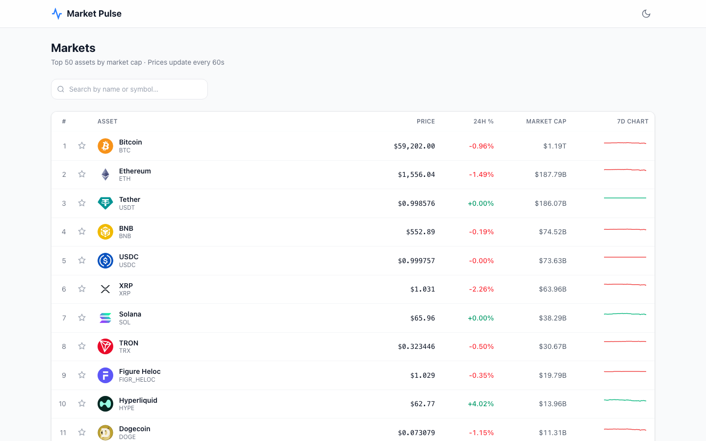

# Market Pulse

**[Live Demo](https://market-pulse-chi-rouge.vercel.app)** <!-- update this URL after first Vercel deploy -->

A production-quality crypto markets dashboard built as a portfolio project for quant/fintech internship applications. It demonstrates clean, typed React architecture, real-time data fetching with aggressive caching, and a maintainable feature-folder structure.



---

## Live Data

Powered by the free [CoinGecko public API](https://www.coingecko.com/en/api) — no API key required. Data is automatically refreshed every 60 seconds with React Query caching.

---

## Tech Stack

| Concern | Choice | Reason |
|---|---|---|
| Bundler | Vite 8 | Fastest HMR, first-class TS support |
| UI | React 18 + TypeScript (strict) | Type safety end-to-end, no `any` |
| Styling | Tailwind CSS v4 | Utility-first, trivially responsive |
| Charts | Recharts | Declarative, React-native, composable |
| Data fetching | TanStack React Query | Caching, stale-while-revalidate, error states |
| Global state | Zustand | Minimal boilerplate for watchlist slice |
| Testing | Vitest + React Testing Library | Native ESM, fast, co-located with Vite |
| Linting | ESLint + Prettier | Consistent style, zero-config |

---

## Features

1. **Ticker table** — top 50 assets by market cap. Sortable columns (price, 24h %, market cap, name). Sparkline mini-charts for 7-day price trend.
2. **Search / filter** — debounced input filters by name or symbol with zero extra API calls.
3. **Asset detail** — click any row to see a full Recharts line chart with selectable 24H / 7D / 30D ranges and key stats (market cap, volume, rank).
4. **Watchlist** — star any asset to pin it in a highlighted section at the top. Persisted to `localStorage` via Zustand's `persist` middleware.
5. **Loading skeletons** — every data-dependent view shows shimmer placeholders instead of spinners, preserving layout during load.
6. **Error handling** — typed `ErrorMessage` component distinguishes rate-limit errors (HTTP 429) from generic API failures with actionable copy.
7. **Light / dark mode** — class-based toggle, respects system preference on first visit, persists the user's choice.
8. **Fully responsive** — mobile-first layout, works from 375 px upward. Table columns progressively hide on smaller screens.

---

## Quick Start

```bash
# 1. Install dependencies
npm install

# 2. Start the dev server (http://localhost:5173)
npm run dev

# 3. Run all tests
npm test

# 4. Production build
npm run build
```

---

## Architecture Decisions

### MarketDataProvider abstraction

```
src/lib/MarketDataProvider.ts   ← TypeScript interface (the contract)
src/lib/coingecko/adapter.ts    ← CoinGeckoProvider implements the interface
src/hooks/useMarkets.ts         ← imports the adapter, never raw fetch
```

The app uses CoinGecko because it is free and keyless — ideal for a portfolio project. In a real fintech context the data source would be Bloomberg, Polygon.io, or an internal pricing service. By defining a `MarketDataProvider` interface and having all consumers (hooks, tests) depend on that interface rather than CoinGecko directly, swapping providers requires only:

1. Writing a new class that satisfies the interface (e.g. `PolygonProvider`)
2. Changing one import line in each hook

This is the **Dependency Inversion Principle** (the D in SOLID) applied at the data layer.

### Feature-folder structure

```
src/features/
  ticker-table/   # filterAssets.ts, sortAssets.ts, TickerTable.tsx, TickerRow.tsx
  asset-detail/   # PriceChart.tsx, RangeSelector.tsx, StatCard.tsx
  watchlist/      # WatchlistSection.tsx
```

Each feature folder owns its logic, pure functions, and components. Pure functions (`filterAssets`, `sortAssets`) are extracted from components so they can be unit-tested without React.

### React Query caching strategy

CoinGecko's free tier limits to ~30 requests/minute. To stay within this limit:

- `staleTime: 60_000` — cached data is considered fresh for 60 seconds; no network request is made during that window.
- `refetchOnWindowFocus: false` — prevents a burst of requests when the user alt-tabs back to the app.
- No retry on `RateLimitError` (HTTP 429) — retrying immediately would just get another 429.

The detail page reads asset metadata (name, logo, price) from the already-cached markets query via `queryClient.getQueryData`, making detail navigation instant with zero extra API calls.

### Zustand for the watchlist

The watchlist is a small, isolated slice of UI state — perfect for Zustand. Redux/Context would add boilerplate (actions, reducers, selectors) with no architectural benefit here. The `persist` middleware handles `localStorage` serialisation; the only custom code is a Set ↔ Array converter because `JSON.stringify` does not serialise `Set` natively.

### TypeScript strict mode

`strict: true` + `exactOptionalPropertyTypes: true` is enabled in `tsconfig.app.json`. This catches the subtle class of bug where a field being `undefined` vs absent matters. The most notable consequence is in the Recharts tooltip, where the cast through `unknown` is explicitly commented to explain why it is necessary (Recharts' internal content-prop types predate `exactOptionalPropertyTypes`).

---

## Project Structure

```
src/
├── components/          # Reusable presentational components
│   ├── ErrorMessage.tsx
│   ├── Layout.tsx
│   ├── PriceChange.tsx
│   ├── Skeleton.tsx
│   ├── Sparkline.tsx
│   ├── StarButton.tsx
│   └── ThemeToggle.tsx
├── features/
│   ├── asset-detail/    # PriceChart, RangeSelector, StatCard
│   ├── ticker-table/    # TickerTable, TickerRow, filterAssets, sortAssets
│   └── watchlist/       # WatchlistSection
├── hooks/               # useMarkets, useAssetHistory, useDebounce, useTheme
├── lib/
│   ├── coingecko/       # HTTP client, raw API types, CoinGeckoProvider adapter
│   ├── MarketDataProvider.ts   # provider interface
│   └── formatters.ts    # pure formatting helpers
├── pages/               # MarketsPage, AssetDetailPage
├── store/               # watchlistStore (Zustand + localStorage)
├── test/                # vitest unit tests
└── types/               # shared domain interfaces
```
